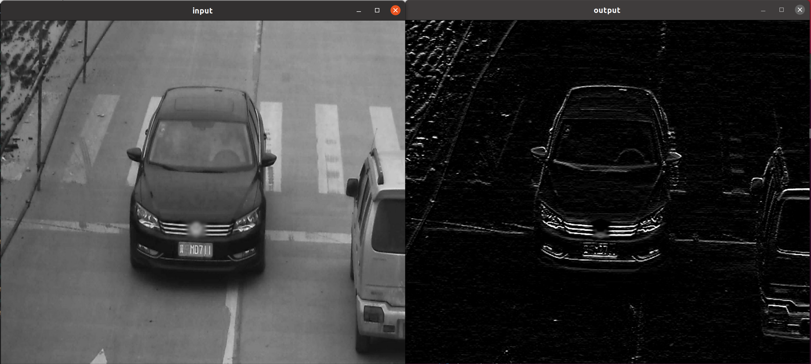

# Sample code of Python extension module written in DPC++ (Data Parallel C++)  

### Description:  
This project demonstrates how to write a Python extension module with DPC++. DPC++ is used to write an image processing kernel in the Python extension. The Python extension will take an OpenCV image stored in a Numpy array and do image processing.  
DPC++ is a Clang based compiler including SYCL extension developed by Intel. It enables seamless heterogeneous computing by support of SYCL and Intel specific extensions for SYCL.  
Numpy object and OpenCV Mat object interaction code example is also included.  

* Result example


### Prerequisites:
- DPC++ compiler (from oneAPI Base Toolkit 2021.3)

### How to build and run:
```sh
build.sh
```
 * `python_dpcpp_module.so` will be generated.
```sh
python3 test.py
```

### Note:  
Tested on Ubuntu 20.04.
